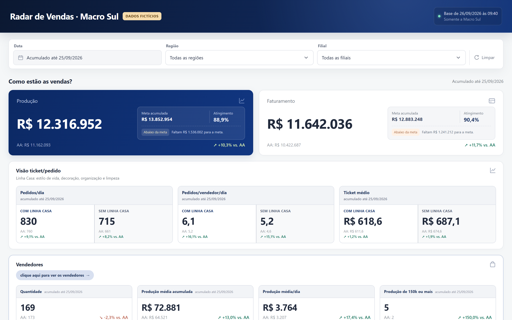
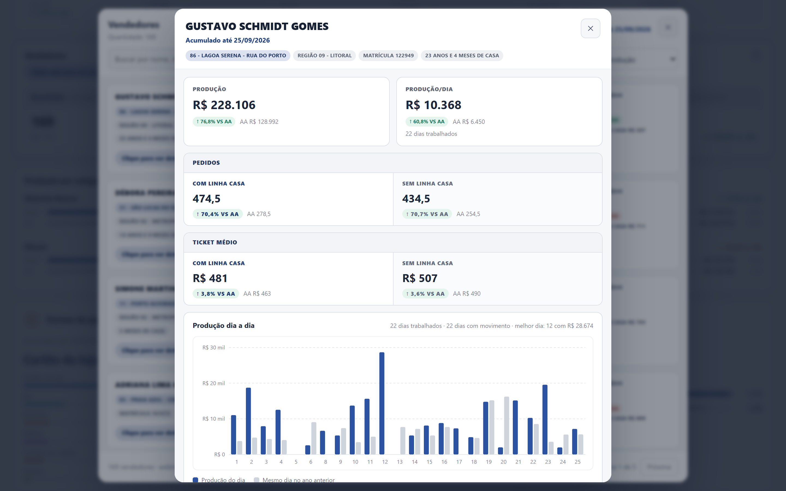
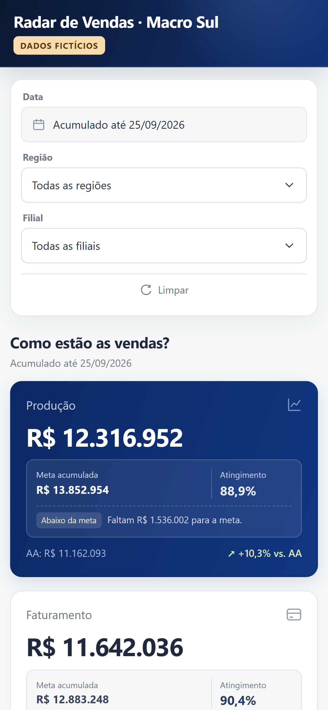

# Radar de Vendas · painel de KPIs do banco de dados ao celular do gerente

**[Abrir a demonstração interativa →](https://dani185silvaa-hue.github.io/)**

## O problema

Os gerentes distritais tinham dificuldade para enxergar os números das suas macros. A informação existia no banco de dados, mas chegava crua, espalhada em várias bases e sem comparação com a meta ou com o ano anterior.

## A solução

Construí o painel de ponta a ponta. Ele reúne produção, faturamento, metas, ritmo de pedidos, equipe de vendas, mix de categorias, formas de pagamento e clientes em uma única tela. Os filtros de data, região e filial recalculam tudo na hora, até o nível do vendedor.

O painel é um único arquivo HTML, enviado todo dia pelo WhatsApp aos gerentes distritais. Eles abrem no celular sem login e sem instalar nada.

| Desktop | Celular |
|---|---|
|  |  |

## Como funciona

1. **Extração (SQL).** Consultas trazem do banco de dados vendas, metas, formas de pagamento e clientes.
2. **Tratamento.** Aplica as regras do negócio: categorias, itens de casa e decoração à parte, dias trabalhados por vendedor, lojas comparáveis e o mesmo período do ano anterior.
3. **Consolidação.** Monta quatro níveis de leitura (macro, região, filial e vendedor), com meta acumulada, atingimento e quanto falta para a meta.
4. **Entrega (HTML, CSS e JavaScript).** As cinco análises vão comprimidas (gzip + base64) dentro do próprio arquivo. O navegador descomprime e calcula os filtros sem servidor.

## Indicadores

Produção · Faturamento · Meta acumulada · Atingimento · Pedidos por dia · Pedidos por vendedor/dia · Ticket médio · Quantidade de vendedores · Produção média por vendedor · Produção média por dia · Vendedores com R$ 150 mil ou mais · Produção por categoria · Formas de pagamento · Clientes únicos · Clientes novos.

Todos os indicadores vêm comparados com o mesmo período do ano anterior.

## Sobre os dados

Esta é uma réplica do layout do painel original, com **dados 100% fictícios**, criados por um gerador com semente fixa. Filiais, vendedores e valores são inventados. O painel original usa dados reais da empresa e não é divulgado.

O resumo em slides está em [assets/carrossel.pdf](assets/carrossel.pdf).

---

**Daniel Silva** · Assistente de Planejamento de Vendas · Engenharia de Produção (FSG)
[LinkedIn](https://www.linkedin.com/in/danielsilva185/)
